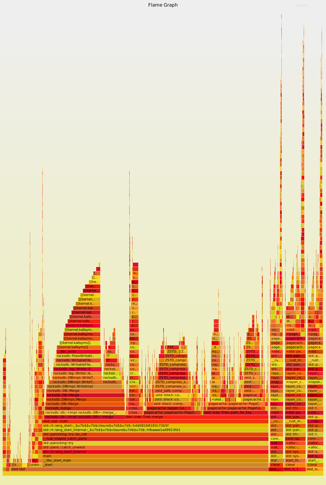

# Toy benchmark comparing RocksDB and Sled

I have created a sketch of a benchmark of RocksDB and Sled trying to decide whether I should use Sled instead of RocksDB for a new project I am developing. From the start, I like more the API of Sled (and its compilation time). However, RocksDB still seems to be the better alternative as of this date. Hopefully, as Sled stabilizes, these conclusions might be different.

## Workload

This is a workload that somewhat resembles my intended usecase: populate the databse with many keys, each associated with a list, to which new elements ca be pushed (but not deleted). I have populated the both Sled and RocksDB with integer 32-bit keys ranging from 0 to 1mi and merged the 32-bit numbers from 0 to 10

## Running it

I have used `jemallocator` and `lto=thin` to get the numbers below. Both database are using compression: RocksDB is using LZ4 and Sled has the `use_compression` enabled. I have also used `cargo flamegraph`, recommended by the author. I have tested them in a Ubuntu 18 Intel i5 machine with an HD drive and 8GB of RAM.

### Results

Here is a sample run. I have made many other runs and thre results have been roughly the same:

|         | merging load | iterating load | disk usage |
|      ---|           ---|             ---|         ---|
| RocksDB |     100s     |      0.85s     |    34MB    |
| Sled    |     207s     |      1.85s     |   226MB    |

RocksDB is still roughly twice as fast as Sled and beats Sled on disk usage. That number has been consistent through all runs. I have noticed that these number become more even when the number of keys is some orders of magnitude smaller, but the number of keys I have proposed is already on the small size of many applications.

For this particular run, I have also got the following flamegraph:

## Questions

- Should these numbers be wildly different in SSD? My computer still uses HD.
- Is this workload really that realistic? It is near to what I intend to use (merging and scanning).
- Have I configured the system the right way? Anything that could have made both databses perform wildly better?

Sled: 143.013933426s
RocksDB: 120.89349547s
[src/main.rs:96] count = 757935405000000
Sled: 1.413365153s
[src/main.rs:108] count = 757935405000000
RocksDB: 1.745378177s
